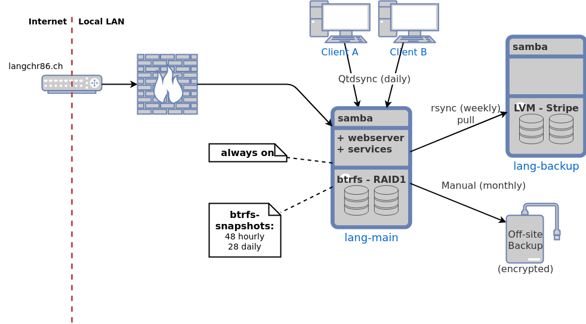

server-config
=============

Configuration of my private server infrastructure.
Completely managed by ansible and linux containers.

Overview
--------

The whole infrastructure has several purposes:

* central data storage with redundancy and change history
* automated backup solution for servers and clients
* protection of private data
* multiple services accessible only in local LAN or internet

The infrastructure consists of multiple hosts
where one is responsible to provide access to internal services through the internet.
The following diagram gives an overview of the relevant hosts and some data flows.

The following services are available:

* local file access: [samba](https://www.samba.org/)
* SSH access hardened by following:
  * https://www.procustodibus.com/blog/2021/12/ssh-jumphost-vs-wireguard-jumphost/
  * https://blog.stribik.technology/2015/01/04/secure-secure-shell.html
* RAID1 and change history: [btrfs](https://btrfs.wiki.kernel.org/index.php/Main_Page)
  and [btrbk](https://github.com/digint/btrbk)
* automatic server and client backups: [rsync and rsync-daemon](https://en.wikipedia.org/wiki/Rsync)
  and [QtdSync](http://qtdtools.doering-thomas.de/)
* disk monitoring: [smartctl](https://www.smartmontools.org/)
* download manager: [jdownloader](https://jdownloader.org/)
* torrent manager: [transmission](https://transmissionbt.com/)
* dyn-dns: [duckdns](https://duckdns.org)
* static web-server and reverse-proxy: [caddy2](https://caddyserver.com/)
* static markdown wiki: [mdwiki](http://www.mdwiki.info)
* password manager: [bitwarden](https://go.bitwarden.com/)
* multi-room audio system: [logitech media server](https://en.wikipedia.org/wiki/Logitech_Media_Server)
* media server: [jellyfin](https://jellyfin.org/)
* media request management: [jellyseerr](https://github.com/Fallenbagel/jellyseerr)
* low-latency voice chat: [mumble](https://www.mumble.com/)
* home automation: [homeassistant](https://www.home-assistant.io/)
  with [mosquitto MQTT](https://mosquitto.org/)

Development with Vagrant
------------------------

The whole setup can be emulated by using virtual machines managed by [Vagrant](https://www.vagrantup.com/).
Some of the usual commands are as follows:

~~~~~~
vagrant up              # create all VMs
vagrant up main         # create only the `main` VM specified in the `Vagrantfile`
vagrant provision main
~~~~~~

See the [Vagrantfile](./Vagrantfile) for more information.

Real deployment
---------------

### BIOS/UEFI

* Enable `Power On` after power loss
* Disable unused LAN adapters
* Enable WOL and allow to boot from USB device (if USB LAN adapter is used)(if this host is controlled by WOL)

### Common setup

* Download corresponding minimal ubuntu LTS server image
* Flash USB stick with [`rufus`](https://rufus.ie/)
* Use guided/minimal installation
* Choose to partition whole primary disk with only one partition for `/`
* Install GRUB bootloader
* Select hostname corresponding to hardware setup and build year
* Create user `clang`
* Install SSH server and no desktop environment
* Remove not working apt sources: `sudo nano /etc/apt/sources.list`

###  Setup passwordless sudo

This can be used for initial setup but should be removed afterward.

~~~
sudo su
printf "clang ALL=(ALL) NOPASSWD: ALL\n" >> /etc/sudoers.d/clang
exit
~~~

### set static IP on ubuntu/debian

~~~
sudo nano /etc/netplan/00-installer-config.yaml
sudo netplan apply
~~~

~~~
# This is the network config written by 'subiquity'
# Changed to static IPs by clang
network:
  version: 2
  ethernets:
    enp0s10:
      addresses:
      - 192.168.0.7/24
      gateway4: 192.168.0.1
      nameservers:
        addresses: [192.168.0.1, 8.8.8.8, 1.1.1.1]
~~~

or

~~~
sudo nano /etc/network/interfaces
sudo reboot
~~~

~~~
auto enp0s5
iface enp0s5 inet static
address 192.168.0.7
netmask 255.255.255.0
gateway 192.168.0.1
dns-nameservers 192.168.0.1 8.8.8.8 1.1.1.1
~~~

### SSH Key

~~~
ssh-copy-id clang@192.168.0.7
~~~

Update system
-------------

~~~
sudo apt-get update
sudo apt-get upgrade
sudo apt-get autoremove
~~~

Wipe existing filesystems
-------------------------

~~~
sudo wipefs -a /dev/sdX
# or
sudo dd if=/dev/zero of=/dev/sdX bs=512 count=1
~~~

Ansible
-------

Install Ansible:

~~~
sudo apt-get update
sudo apt-get install -y python3 python3-pip
sudo pip3 install passlib ansible
~~~

Create ansible vault PW file: `infra_pw`
and run specific ansible playbook launcher script, e.g.:

~~~
./backup.sh
~~~

Detail or manual steps
----------------------

[Documentation](/docs)
