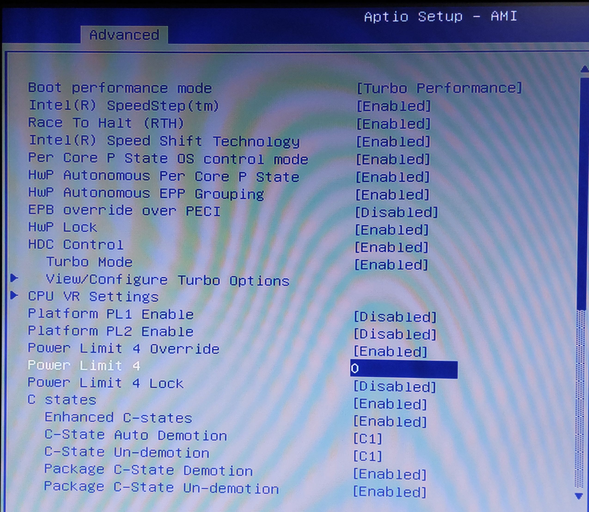
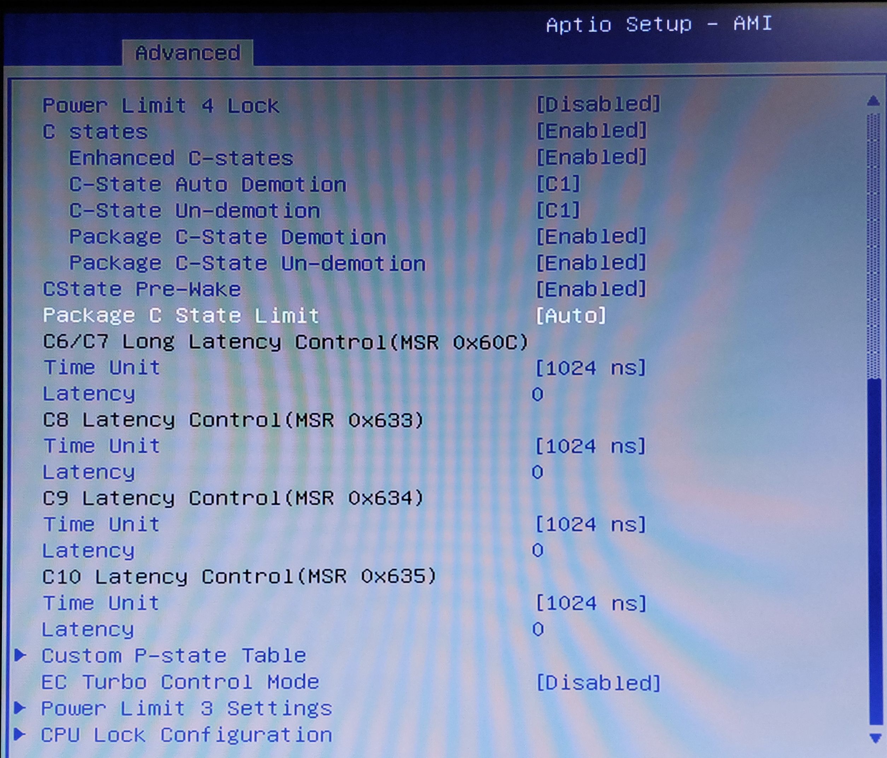
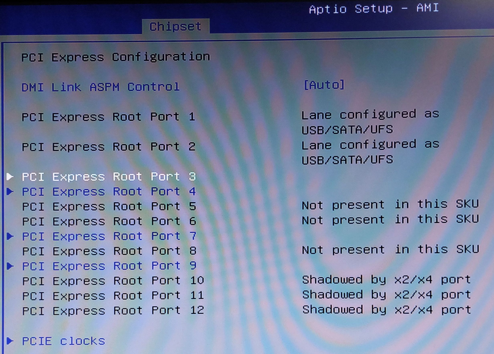
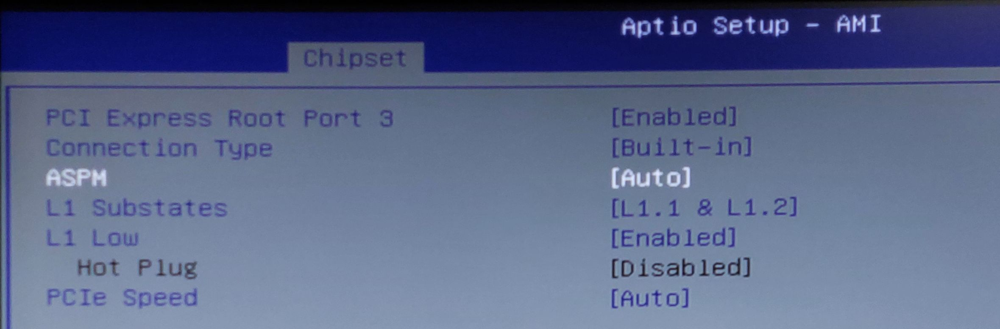
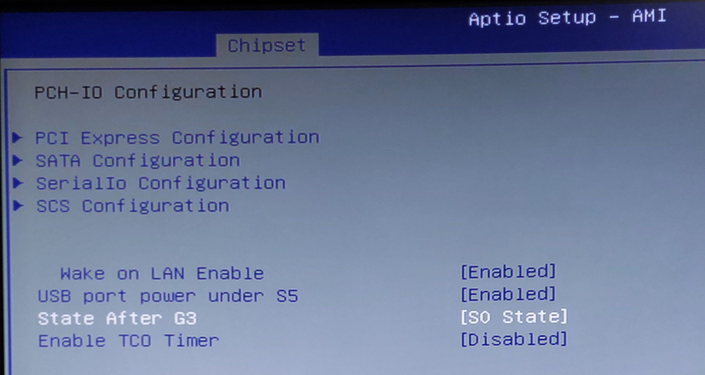
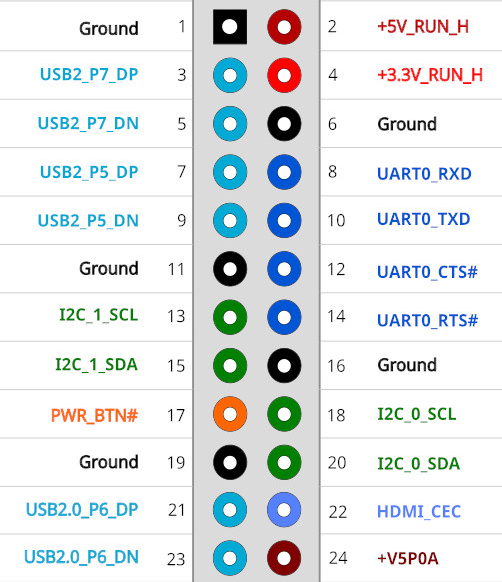

Hardware: Odroid H4 Ultra
=========================

BIOS settings
-------------

The following BIOS settings will ensure the best performance with the lowest power consumption.

Most of the information can be found under the following links:

* https://www.hardkernel.com/shop/odroid-h4-ultra/
* https://wiki.odroid.com/odroid-h4/start
* https://forum.odroid.com/viewtopic.php?t=48470

Unlimited Performance Mode:  
`Advanced` -> `Power & Performance` -> `CPU - Power Management Control` -> `Power Limit 4`:
set to `0`.

ASPM (Power Management for PCIe & SATA):  
`Chipset` -> `PCH-IO Configuration` -> `PCI Express Configuration`:
set `ASPM` to `auto` in all `Root Port` 3, 4, 7 and 9.

Autoboot after power-loss:  
`Chipset` -> `PCH-IO Configuration` -> `State After G3`:
set to `S0 State`.

Ethernet ports
--------------

Both ports are using the Intel I226-V Chip.

The right port is the first one listed in Linux.

Expansion port
--------------

The description can also be found here: https://wiki.odroid.com/odroid-h4/hardware/io_expansion_gpio
